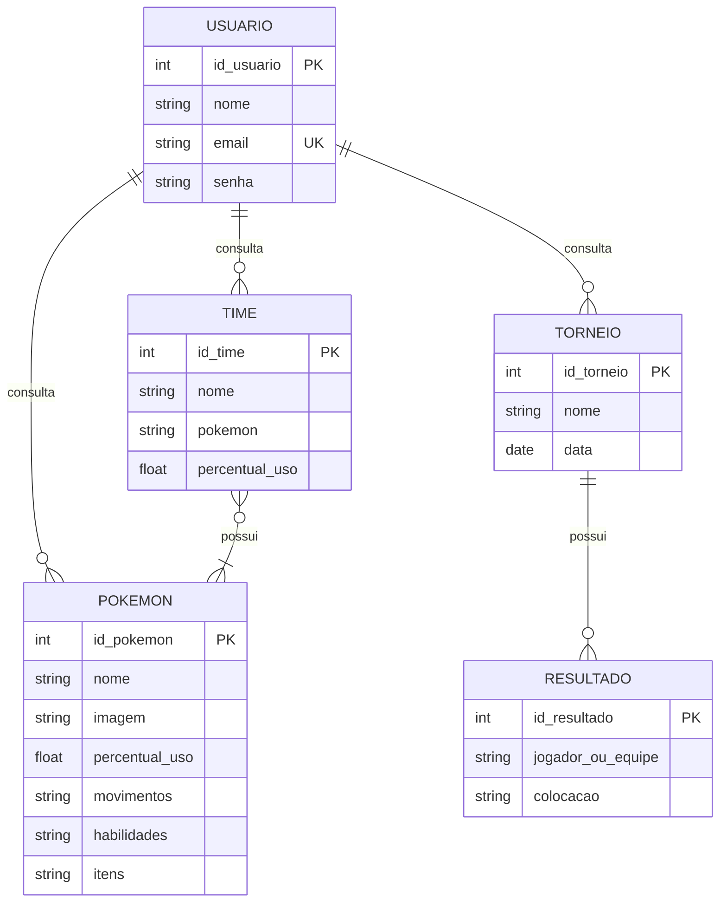

# 🛠️ Especificação Técnica (Tech Spec) - Watchlog

Este documento detalha a arquitetura técnica, o modelo de dados e os contratos de API (via JSON Server) necessários para o funcionamento do sistema Watchlog.

## 1. Modelo de Dados (Diagrama ER)

Abaixo está o Diagrama Entidade-Relacionamento (DER) que representa a estrutura do nosso "banco de dados" (`db.json`) e como as informações se conectam.

## 2. Tecnologias Utilizadas

Abaixo terão as especificações tecnicas do que será utilizado no projeto.

- **Bootstrap** - v5.3
- **JQuey** - v4.0.0
- **JSON Server** - v1.0.0
- **Pokemon Champions Battle Data API** - v1.0
- **PokéApi** - v2.0
